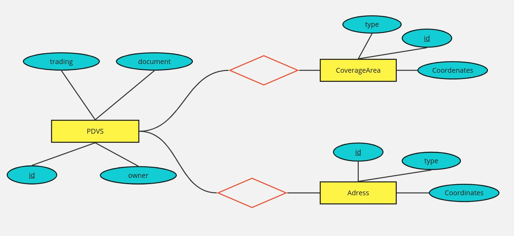
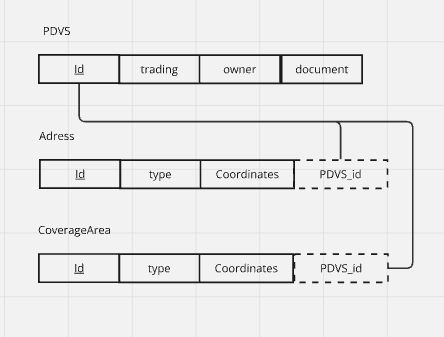

# Zé Code <br> Desafio Backend
## 🍻 Apresentação

Zé Deliver é um aplicativo que nunca te deixa na mão quando acaba a cerveja, pois te permite pedir bebidas onde e como quiser. 

Além do aplicativo permitir essa dinâmica flexivel ao fazer seu pedido, você receberá sua cerveja sempre gelada, pronta para beber e no conforto de sua casa, uma vez que a empresa se baseia em uma rede de estabelecimentos e o aplicaitvo garente que o seu pedido sempre será encaminhado para o mais proximo de você para atender essas demandas. 

O projeto apresentando consiste na organização desses parceiros e construção de um programa que busque aquele que se encontra mais proximo da coordenada inserida pelo cliente. 

## 💾 Banco de Dados

O banco de dados do projeto tem como objetivo organizar em tabelas as informações dos parceiros deste arquivo [JSON](pdvs.json)

**MODELO ENTIDADE RELACIONAMENTO**

<br>
<div align="center">
  
  <p align="center"> Diagrama que representa as relações entre as entidades no banco </p>
</div>

<br>
<div align="center">
  
  <p align="center"> Representação ER do projeto no formato das tabelas </p>
</div>
<br>

**TABELAS** <br>

Apresentação das tabelas presentes no banco de dados

- pdvs.csv → tabela bruta que é a versão convertida do JSON direto em csv. As próximas tabelas foram criadas derivadas dessa para criar as entidades do banco de dados.

- Parceiros.csv → armazena as informações principais de cada parceiro do Zé Deliver. No JSON, essa tabela engloba os campos `tradingName`, `ownerName` e `document`

- CoverageAreas.csv → as informações seguem o padrão `GeoJSON MultiPolygon` para desenhar a area de atuação de cada parceiro. No JSON, essa tabela engloba os campos `coverageArea` e `type` para cada um 
dos clientes, representados pelo <ins> id </ins>	

- Parceiros.csv → armazena as coordenadas do endereço de cada parceiro do Zé Deliver. No JSON, essa tabela engloba os campos `adress` e `type`

**Extra:** a pasta ['Popular_bancos'](BDs/Popular_bancos) dentro do diretorio 'BDs' possui os codigos python desenvolvidos para manipular a tabela pdvs.csv e popular as tabelas/entidades do banco de dados

As tabelas do banco de dados se encontram [aqui](BDs)
<br>

**MANIPULAR BANCO** 

No SQL, o usuario pode executar alguns comandos para ter uma leitura melhor do banco de dados e suas relações

1. Unir algum parceiro pelo seu id à sua respectiva coverageArea:
  ```
  SELECT Pdvs.trading, CoverageArea.type, CoverageArea.coordinates
  FROM Pdvs
  RIGHT JOIN CoverageArea
  ON Pdvs.id = CoverageArea.id
  WHERE Pdvs.id = [escolha_id];
  ```
## 🌐 Site

O site do Zé Code te permite escolher tanto entre adicionar o id de um parceiro e encontrar sua coverageArea no Google Maps quanto inserir um ponto em x e y para retornar aquele mais proximo de você.

Na construção desse sistema do site foi necessário um arquivo javascript que interpreta as informações de coordenada de cada parceiro a partir do arquivo json com todas as informações. Após manipular esses dados, as coordenadas do parcceiro, salvas em uma lista de dicionários, são lidas pela API do Google Maps para criar um poligono com sua localização geografica no mapa. 

<br>

<div align="center">
  
  <p align="center"> Utilizando a função de achar parceiro pelo Id </p>
</div>
<br>

Além disso, o arquivo js também incorpora uma função responsável por ler coordenadas de um ponto no plano cartesiano passadas pelo usuário e buscar se ele está contido na coverage area de algum parceiro. Caso não esteja na área de atuação de algum deles, o programa retorna aquele no qual o endereço é o mais próximo do ponto passado pelo usuário. 

<br>

<div align="center">
  
  <p> Passando uma coordenada para buscar o parceiro mais próximo </p>
</div>

<br>

O codigo se encontra [aqui](scripts/index.js). Já para visitar o site, basta acessar o [arquivo html](templates/home.html) e abri-lo em seu navegador. 

## 👨‍💻 Desenvolvedor
Responsável pela criação do projeto

Diego - Programação e documentação

Conheça mais acessando o GitHub do desenvolvedor [aqui](https://github.com/Di3go07)!
